<p align="center">
  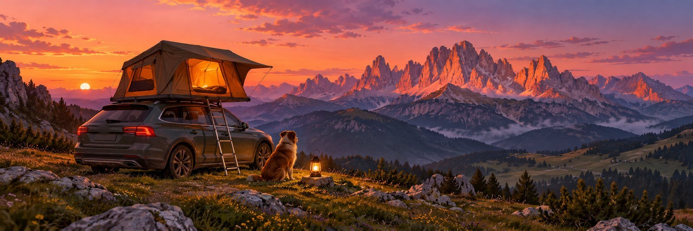
</p>

# Vanlife Planner

**Plan a road trip in a rooftop tent, a campervan or a motorhome, and let your assistant check
every night, route and arrival time against the rules of the road and the hour of sunset.**

[](./LICENSE)
[](https://github.com/liketrek/TREK)
[](#mcp-tools)
[](#works-with-chatgpt-and-claude)

A plugin for [TREK](https://github.com/liketrek/TREK), the self-hosted trip planner: legal nights, sunset-safe arrivals, routes, schedules,
supplies, the price and amenities of every place, the hosts' contacts and where each night stands
(spotted, in discussion, booked, dropped) — as MCP tools any assistant connected to TREK can call
(ChatGPT, Claude…), as warnings in the planner, as chips on each place (hover card, places list)
and as a small panel at the foot of the place view.

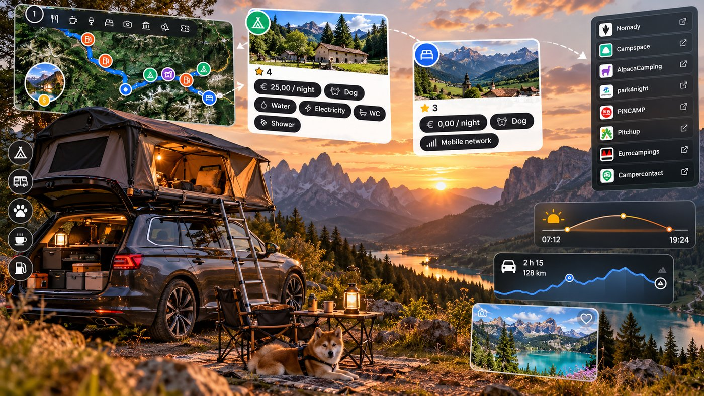

## Screenshots

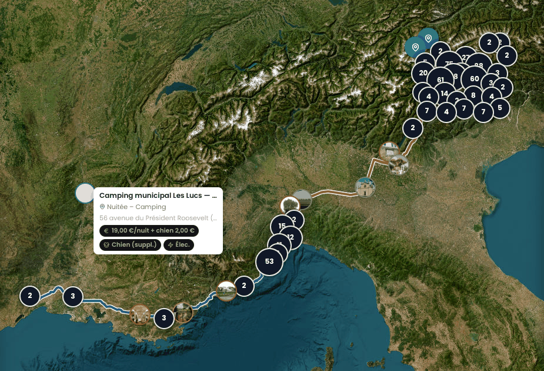

<table>
  <tr>
    <td width="50%" valign="top">
      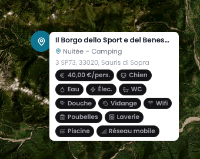
      <br><sub><b>Hover card on the map.</b> The price per person and one chip per amenity
      (dog, water, electricity, toilets, shower, dump station, wifi, bins, laundry, pool, mobile data),
      filled from park4night and OpenStreetMap.</sub>
    </td>
    <td width="50%" valign="top">
      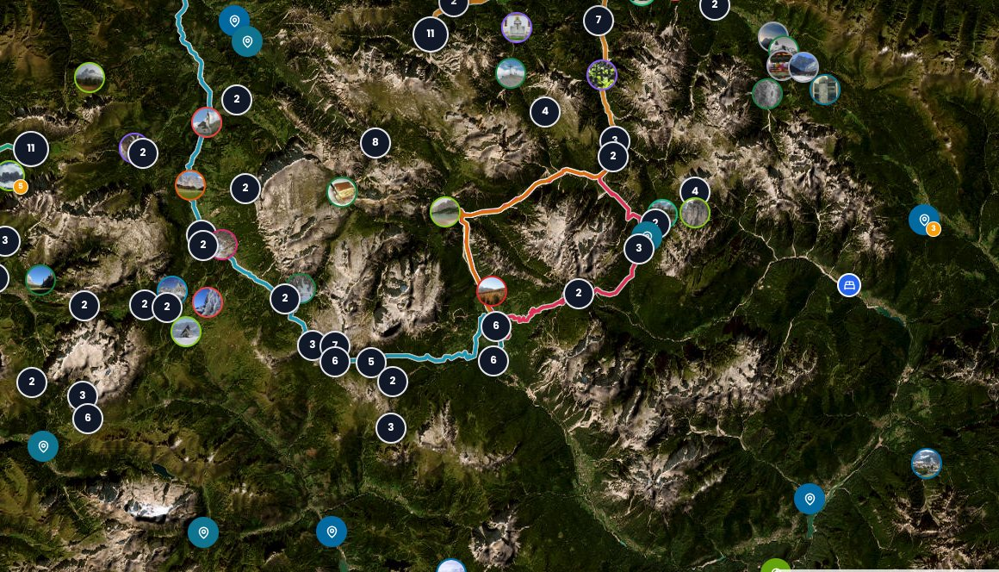
      <br><sub><b>Day routes.</b> Each day's road computed with Valhalla for the vehicle's height,
      length and weight, drawn in the day's color.</sub>
    </td>
  </tr>
  <tr>
    <td width="50%" valign="top">
      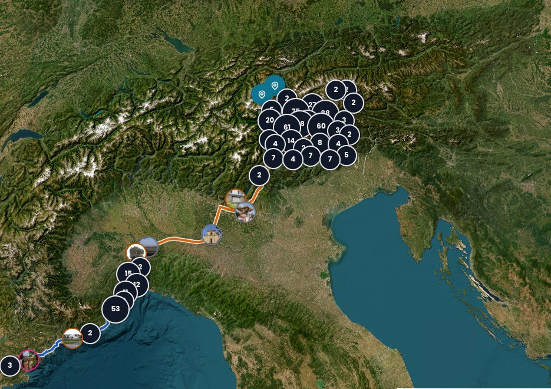
      <br><sub><b>The whole trip.</b> Driving days from the coast to the mountains, with every
      candidate night clustered on the map.</sub>
    </td>
    <td width="50%" valign="top">
      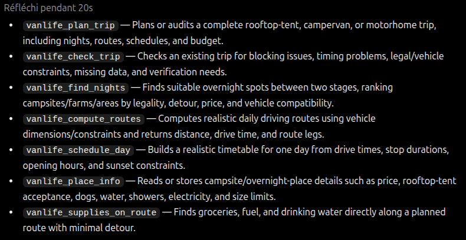
      <br><sub><b>From ChatGPT.</b> Asked which Vanlife tools it has, ChatGPT lists them through
      TREK's MCP server (captured with version 0.3.0; since 0.4.0 the day and place tools are
      merged into <code>vanlife_day</code> and <code>vanlife_place</code>).</sub>
    </td>
  </tr>
  <tr>
    <td width="50%" valign="top">
      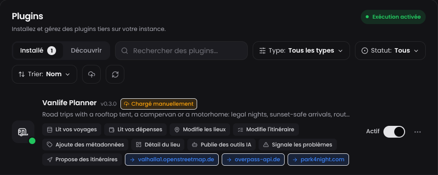
      <br><sub><b>Admin → Plugins.</b> Every permission and outbound host shown on the card
      before the admin turns the plugin on.</sub>
    </td>
    <td width="50%" valign="top">
      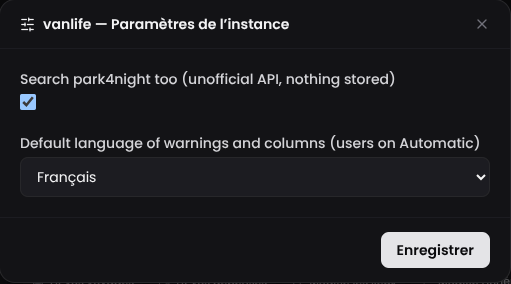
      <br><sub><b>Instance settings.</b> park4night on or off, and the default language of
      warnings and columns.</sub>
      <br><br>
      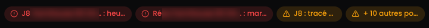
      <br><sub><b>Warnings in the planner.</b> Blocking points in red, points to verify in amber
      (place names blurred here).</sub>
    </td>
  </tr>
</table>

## What it does

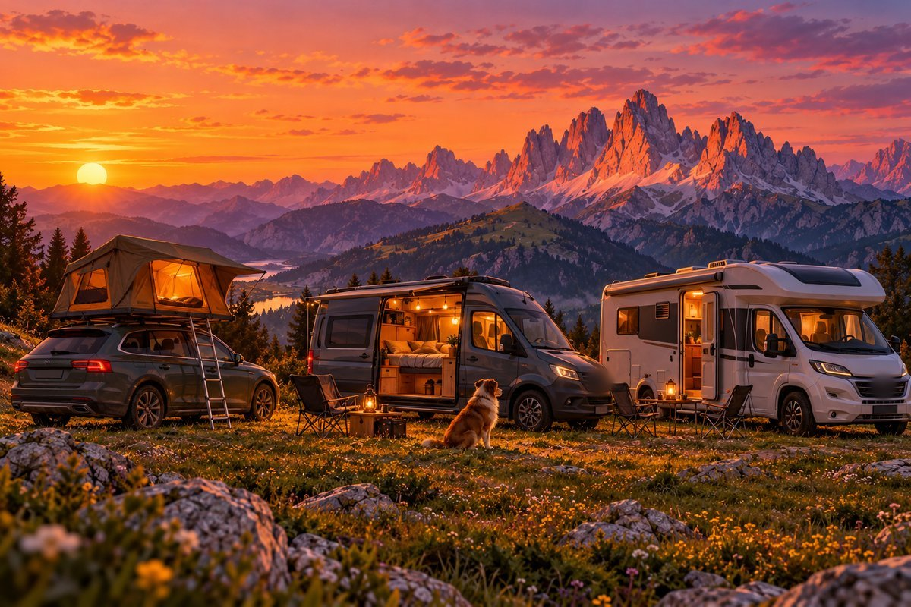

The vehicle is a setting, and the rules follow it, anywhere in the world. A rooftop tent has to be
unfolded in daylight, and opening it is camping: by default the plugin applies the strictest rule
it knows (the Alps): a campsite, a farm, or private ground with the owner's consent, never public
ground. A night it cannot place is flagged to check. Sleeping
inside a van or a motorhome without setting anything out is parking in Italy (Codice della strada
art. 185), so a motorhome area is fine there, while many South Tyrol municipalities forbid
camping on public ground.

- **Trip check** — day by day, at four levels (blocking / to fix / to verify / info): arrival at
  the night later than *sunset minus a margin* (computed for the exact date and place); a stop
  visited on its closing day or outside the hours quoted in its notes; a check-in window or minimum
  stay not met; a night the vehicle may not use; a farm night to check where local rules apply
  (South Tyrol: allowed on private ground with the owner's consent, except in protected areas or
  where a municipal rule forbids it); impossible times; a shopping detour over the limit; nights in a row without water; a
  place that refuses the vehicle, the dog, or the vehicle's height, length or weight.
- **Map overview** — every planned stop of every day as a small dot on the trip map, whatever day
  is selected, each with the pictogram of its kind: green means confirmed or planned, blue a night not
  asked for yet, amber a night in discussion, red a cancelled one; a place with no dot is not in the
  plan.
  A tap gives the days and the times. Off with the *map overview* setting.
- **One look everywhere** — every colour and pictogram the plugin shows comes from one catalogue,
  `server/lib/design.js`. On the map, the **colour says the state** (disc and border), the
  **pictogram says the kind** of place. See *Map legend* below.
- **Nights** — candidates between the evening's last visit and the next morning's first stop, from
  OpenStreetMap and, if the instance enables it, park4night; ranked by legality, price and real
  detour.
- **Routes** — the road of each day with [Valhalla](https://valhalla1.openstreetmap.de) for the
  vehicle (height; length and weight for a motorhome), no tolls except on the motorway days you
  choose; also two route profiles in the planner's route toggle.
- **Schedules** — start and end of every stop from real drive times.
- **Supplies** — supermarkets, fuel and drinking water along the day's route, with that day's hours.
- **Price and amenities** — per night or per person, dog fee, height/length/weight limits, and the
  amenities park4night and OpenStreetMap know (dog, water, electricity, toilets, shower, dump
  station, wifi, bins, laundry, pool, shop, bakery, restaurant or snack bar, bar, mobile data,
  playground, barbecue, gas bottles, LPG, vehicle wash, open in winter, rooftop tent accepted).
  The price is TREK's own field; the rest is kept on the place by the plugin. Unknown amenities are
  **filled automatically** from OpenStreetMap (the campsite mapped within 150 m) and from
  park4night (the place a park4night link points to), citing the source; a value a person recorded
  is never overwritten.
- **Hosts and nights** — the contact of each host (e-mail, phone, WhatsApp, website, name,
  languages, preferred channel), filled from the place's own notes, OpenStreetMap and park4night;
  a log of what was asked and answered; the status of every night, kept in TREK's own bookings;
  and a ready-to-send information request to a host, in English then French (Italian or German
  on request), built from what is still unknown about the place. The plugin never sends it: the
  assistant shows the exact text and waits for your go.

### Timed access, booking, toll

Some places can only be reached at certain hours, or not without a ticket: a mountain toll road
closed to cars after 09:00, a valley road open to cars only in the evening, a car park with
time slots to book. Each place can record, in the widget or with `vanlife_place` `set` (`null`
clears a field):

| Field | Meaning |
|---|---|
| `access_before` | `"HH:MM"`: arrive before this time, the road is closed after it. |
| `access_after` | `"HH:MM"`: cars allowed only after this time. With both fields, `access_before` earlier than `access_after` means closed in between; later means open in between. |
| `booking_required`, `booking_url`, `booking_note` | A booking is required (slot, car park, road permit), where to make it, and a short note (120 characters at most). |
| `toll_amount`, `toll_currency` | Toll or ticket per vehicle, and its 3-letter currency (default: the trip's). |

Example, a mountain toll road: `{"access_before": "09:00", "booking_required": true,
"booking_url": "https://toll-road.example.com", "toll_amount": 30, "toll_currency": "EUR"}`.
The trip check then says, from the arrival time of the stop (its own time, or the time the day's
drives give): an arrival after `access_before` is *blocking*, an arrival before `access_after`
is *to fix*, a booking with none recorded in TREK's bookings or the stop's notes is *to verify*,
with the link. `vanlife_day` `schedule` moves the proposed departure so every access is met.
The toll is added to that day's budget in `vanlife_plan_trip`. Each recorded field shows as a
small chip on the place: *Before 9:00 AM*, *Booking*, *Toll €30.00*.


## Map legend

The colour of a marker is its state, and nothing else:

| | State | Meaning |
|---|---|---|
|  | **Booked** | the host confirmed the night |
|  | **In discussion** | the host was asked, no answer or no confirmation yet |
|  | **Cancelled** | the night was dropped |
|  | **Available** | planned or not, but neither booked, in discussion nor cancelled — an activity is always blue |

The pictogram is the kind of place. The plugin draws its own for the ways to sleep that TREK's
icon set lacks (`assets/icons/*.svg`, built into the markers by `npm run build-glyphs`):

| | | | | | |
|---|---|---|---|---|---|
|  |  |  |  |  |  |
| Motorhome area | Rooftop tent | Campervan | Car | Campsite / tent | Bivouac |

A night in a car park or a wild spot shows the traveller's own vehicle (rooftop tent, campervan or
motorhome, from the settings). Other kinds use TREK's icons: a leaf for a farm (agricamping), a
home for a private host or a cabin, a mountain for a hut, a bed for a hotel; for activities a
mountain (hike, lift), waves (lake, beach, pool), a tree (nature), a camera (viewpoint), a church,
a landmark (village, museum), a store (market), a bag (groceries), cutlery (restaurant, hut), a cup
(café), wine, beer, theatre, music, a bike, a boat, a train, a bus, a plane, a dumbbell (sport), a
compass (tourist office), a heart (zoo), a car (fuel, parking) and a flag (departure and return).

From an assistant, one sentence sets both: *"the farm on day 2, we booked it"* is
`vanlife_night` with `kind: "farm"` and `status: "booked"` — the place moves to the trip's farm
category (leaf) and its marker turns green.

## MCP tools

Advertised to assistants as `plugin_vanlife_<name>`; the MCP client needs the opt-in
`plugins:use` scope.

| Tool | What it does |
|---|---|
| `vanlife_plan_trip` | All-in-one: check, cheaper legal nights nearby, routes, schedules, budget; proposes by default, writes only when asked. |
| `vanlife_check_trip` | Read-only check of a trip for the user's vehicle, including nights with no contact and hosts who have not answered for over 3 days. |
| `vanlife_find_nights` | Night candidates for one evening (OpenStreetMap, park4night when enabled), with the contacts OpenStreetMap knows. |
| `vanlife_day` | One tool, three actions: `routes` (road route of each day), `schedule` (times of one day from real drive times), `supplies` (groceries, fuel and water along a day's route). |
| `vanlife_place` | Everything about a place: list by filter, read, `set` (amenities, price details, timed access, booking, toll, contacts), `log` an exchange, `clear` / `clear_fields`, `fill` from open sources. |
| `vanlife_night` | `list` where each night stands; `set` a night as spotted, contacted, booked or dropped (a TREK booking pending, confirmed or cancelled). |
| `vanlife_host_message` | Drafts the information request to a host (English, then French); sends nothing. |

TREK accepts 8 tools per plugin: the eighth place is left free on purpose.

No tool books, pays or writes to anyone. `vanlife_night` records what you declare, and every tool
that deals with hosts tells the assistant to show you the exact text and wait for your explicit
validation.

## Works with ChatGPT and Claude

The tools live on TREK's own MCP server, so any assistant that speaks MCP can use them.

1. In TREK, an admin installs and turns on the plugin (Admin → Plugins) and enables MCP access.
2. In the assistant, add TREK as a connector or custom app: the MCP address is
   `https://<your-trek>/mcp`, and the sign-in must grant the **`plugins:use`** scope (no client
   preset asks for it, so request it by name). ChatGPT: Settings → Apps → create an app with that
   address. Claude: Settings → Connectors → add a custom connector.
3. Ask in plain words: *"Check trip 1 for my rooftop tent"*, *"Find a cheaper legal night near
   day 4"*, *"Draft a message to the host of day 6 asking about dogs and late arrival"*.

After a plugin update, the assistant keeps the old tool list until it is told to reload it: in
ChatGPT, open the app's settings and click **Refresh tools** (*Actualiser les outils*); in Claude,
reconnect the connector.

## Where it shows in TREK


- **Warnings banner** — blocking and to-verify points, in the user's language.
- **Place chips** — the night's status first (*Booked ✓* green, *In discussion* orange, *Dropped*
  red, on places that have a booking), then the price and one chip per amenity the place has (dog,
  water, electricity first), plus a red chip listing what it lacks when that rules it out: the
  places list, and the map's hover card
  once an admin lets the plugin in (Admin → Default user settings → *Plugin info on places*).

  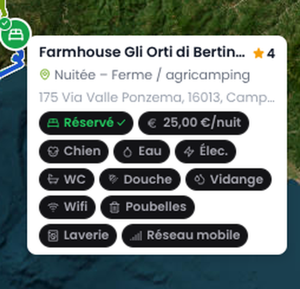 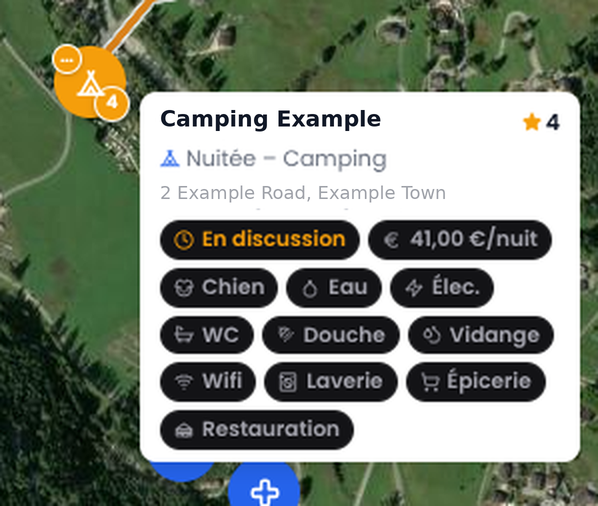
- **Place panel** — a widget at the foot of the place view shows the night's status, the host's
  contact (e-mail, phone and website as links, last exchange) and the amenities; it edits the
  amenities and the contact, and has a *Fill the trip's amenities* button. Opening a place with
  nothing recorded looks it up once.
- **Settings** — TREK's native forms: per user (vehicle, dimensions, dog, target and ceiling price,
  sunset margin, language…) and per instance (park4night on or off, default language).

## Setup

1. Install the plugin from its zip (Admin → Plugins), and grant the permissions it asks for.
2. Optionally, in Admin → Plugins → Instance settings: turn park4night off, choose the default
   language.
3. Each traveller sets the vehicle, its dimensions, the dog, the prices and the sunset margin in
   Settings → Plugins.
4. To use the tools from ChatGPT, Claude or another assistant, connect it to TREK's MCP server
   with the `plugins:use` scope; the tools appear as `plugin_vanlife_vanlife_*`.

## Permissions

| Permission | Why |
|---|---|
| `db:read:trips`, `db:read:categories`, `db:read:costs`, `db:read:todos` | Read the trip being checked or planned. |
| `db:write:places`, `db:write:itinerary` | Write a route place or a chosen night, only when an assistant is asked to apply; copy a host's website or phone into the place's empty TREK fields. |
| `db:write:reservations` | Record the status of a night as a TREK booking (pending, confirmed, cancelled), only when you say so. |
| `db:meta` | Keep the price details, amenities, host contacts and exchange log on the place itself (the plugin's own namespaced data; writes need the user's place edit right). |
| `db:own` | Cache of drive times and OpenStreetMap answers; which places were already looked up (ids and dates only). |
| `mcp:tools` | Publish the tools above. |
| `hook:trip-warning-provider` | The warnings banner (cache only, no network). |
| `hook:route-provider` | The two route profiles. |
| `hook:table-contributor` | The night status, price and amenities chips on each place. |
| `hook:map-marker-provider` | The trip overview on the map: a small dot for every planned stop of every day (green planned, amber in discussion, red dropped). Off with the *map overview* setting. |
| `http:outbound:valhalla1.openstreetmap.de` | Drive times and road geometry. |
| `http:outbound:overpass-api.de` | Campsites, shops, fuel, water and campsite amenities from OpenStreetMap. |
| `http:outbound:park4night.com` | park4night search and amenities, only if the instance enables it. |

Only coordinates (and, for park4night, the language) leave the server — never names, notes,
contacts or anything about the travellers. Host contacts stay in your TREK instance.

### About park4night

park4night publishes no API: the plugin reads the endpoint its own web map uses, which may change
without notice. Calls are rate-limited (20 per hour, 3 s apart). Search results are not stored;
when amenities are filled, only the yes/no amenities of a place that is already in your trip are
copied onto that place, with its park4night number as the source. An admin can turn park4night
off in the instance settings, and the plugin then uses OpenStreetMap alone.

## Limits worth knowing

Zone outlines are coarse (check a night near a border by hand). The public Overpass server allows
few queries per server, so searches may answer "busy, try again in a minute". OpenStreetMap often
lacks amenities, and has no reviews. Nothing here books, pays or messages anyone.

## Development

```bash
npm install
npm test               # vitest, mock TREK host, no network
npm run coverage
npm run sync-manifest  # copy server/lib/tool-specs.js into trek-plugin.json
npm run validate && npm run pack
```

Data: © OpenStreetMap contributors (ODbL), routing by Valhalla on the FOSSGIS servers,
park4night data © park4night.

## Contributing

See [CONTRIBUTING.md](./CONTRIBUTING.md).

## License

MIT — see [LICENSE](./LICENSE).
